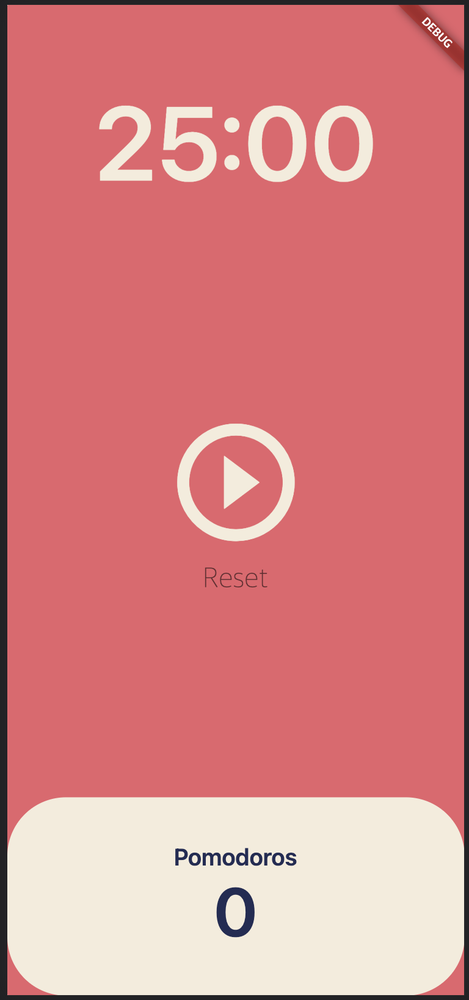
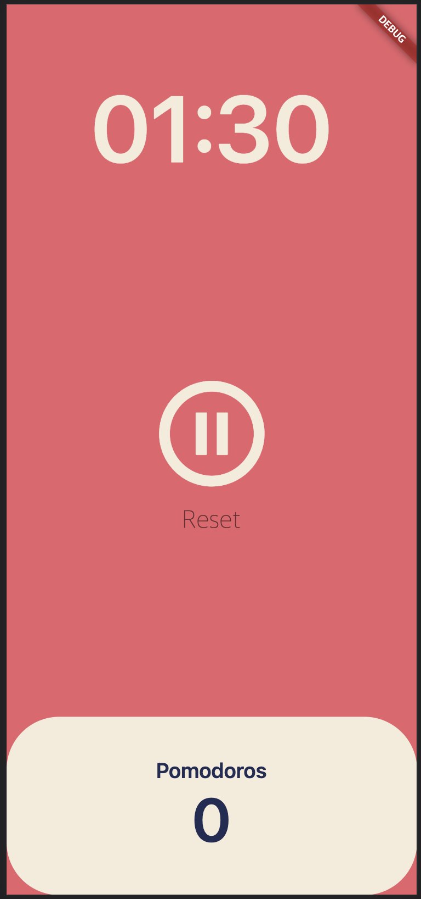

# pomodoro

A new Pomodoro project.
The method of focusing on work for 25 minutes using a timer and then resting for 5 minutes is called Pomodoro.

The project was written to improve concentration by repeating a 25-minute timer.

## Screenshot

